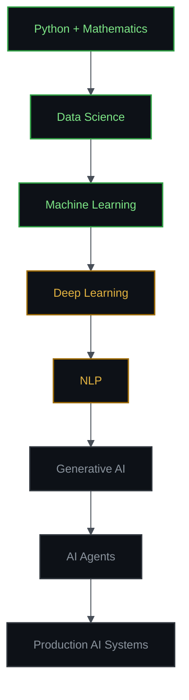

<!--=====================================================================
  PROFILE README — terminal / dark-console aesthetic
  Replace every `your-username`, `your-handle` and `you@example.com`
  placeholder before publishing.
======================================================================-->

<div align="center">

# VIKAS VISHWAKARMA

**<samp>Python · Data Science · Machine Learning · AI Engineering (in progress)</samp>**

<samp>Turning datasets into decisions — and models into things people can actually use.</samp>

<br/>

[](https://github.com/your-username)
[](https://www.linkedin.com/in/vikas-vishwakarma-62959a387/)
[](mailto:vikas221018@gmail.com)

</div>

---

## <samp>01 · $ whoami</samp>

```console
┌──[ vikas@github ]──[ ~/profile ]
└─$ whoami

  name        : Vikas
  role        : Developer moving into Data Science / ML
  focus       : Python · EDA · Classical ML · heading into Deep Learning
  builds      : notebooks that answer questions,
                apps that survive real users
  timezone    : IST (UTC+5:30)
  open_to     : Data Science / ML internships · collaboration
```

---

## <samp>02 · $ cat about.md</samp>

I started from general software development — C, Java, full-stack web, mobile —
and I'm now deliberately moving that foundation toward **Data Science, Machine
Learning and AI engineering**.

My approach is simple: every concept I study has to end up inside something that
runs. Regression became an insurance-cost predictor. Classification became a
loan-approval model and a revenue-intent classifier. EDA became an interactive
IPL analytics dashboard.

I'm comfortable with Python and the classical ML stack. Deep Learning, NLP and
AI agents are where I'm actively learning — and I mark them that way rather than
pretending otherwise.

---

## <samp>03 · $ systemctl status skills</samp>

```diff
@@ SYSTEM STATUS ── capability report @@

+ [ ONLINE  ]  Python                      core language, daily driver
+ [ ONLINE  ]  Mathematics & Statistics    linear algebra · probability · inference
+ [ ONLINE  ]  Data Analysis / EDA         NumPy · Pandas · Matplotlib · Seaborn
+ [ ONLINE  ]  Classical Machine Learning  scikit-learn · boosting · clustering
+ [ ONLINE  ]  Software Engineering        full-stack web · mobile · databases

! [ LOADING ]  Deep Learning               neural nets · backprop · architectures
! [ LOADING ]  Natural Language Processing text pipelines · embeddings

  [ QUEUED  ]  Generative AI               LLM app patterns · RAG
  [ QUEUED  ]  AI Agents                   tool use · orchestration
  [ QUEUED  ]  Production AI Systems       serving · monitoring · MLOps

  legend: + proven in projects   ! actively learning   · queued next
```

---

## <samp>04 · $ cat mission/current.target</samp>

```console
┌─ TRAJECTORY ─────────────────────────────────────┐
│                                                  │
│   Developer                        [ current  ]  │
│       ↓                                          │
│   Data Scientist                   [ in-flight]  │
│       ↓                                          │
│   ML Engineer                      [ next     ]  │
│       ↓                                          │
│   AI Engineer                      [ target   ]  │
│                                                  │
└──────────────────────────────────────────────────┘

note: this is a roadmap, not a résumé.
      each stage is earned by shipping, not by reading.
```

**Currently building toward:** deep-learning fundamentals implemented from
scratch, then NLP pipelines, then LLM-powered applications that combine my
full-stack background with model work.

---

## <samp>05 · $ cat roadmap.yml</samp>



<details>
<summary><samp>▸ expand phase breakdown</samp></summary>

<br/>

| Phase | Stage | Contents | State |
|:--|:--|:--|:--|
| `00` | Foundations | Python, linear algebra, probability, statistics | done |
| `01` | Data Science | EDA, cleaning, preprocessing, feature engineering, correlation & statistical analysis | done |
| `02` | Machine Learning | regression, classification, ensembles, clustering, tuning, evaluation | done |
| `03` | Deep Learning | neural networks, backpropagation, optimization, CNNs | active |
| `04` | NLP | tokenization, embeddings, sequence models, transformers | active |
| `05` | Generative AI | prompt engineering, RAG, evaluation of LLM outputs | queued |
| `06` | AI Agents | tool calling, planning loops, multi-step orchestration | queued |
| `07` | Production AI | serving, APIs, monitoring, reproducible pipelines | queued |

</details>

---

## <samp>06 · $ ls -R stack/</samp>

### `data/`

| Layer | Stack |
|:--|:--|
| **Libraries** | `NumPy` · `Pandas` · `Matplotlib` · `Seaborn` |
| **Techniques** | Exploratory Data Analysis · Data Cleaning · Data Preprocessing · Feature Engineering |
| **Analysis** | Statistical Analysis · Correlation Analysis · Distribution & Outlier Study |
| **Environment** | `Jupyter Notebook` |

### `machine-learning/`

| Family | Models & Methods |
|:--|:--|
| **Framework** | `scikit-learn` |
| **Linear** | Linear Regression · Logistic Regression · `Lasso` · `Ridge` · `ElasticNet` |
| **Instance / Probabilistic** | K-Nearest Neighbours · Naive Bayes · Support Vector Machines |
| **Trees & Ensembles** | Decision Trees · Random Forest · `XGBoost` · `LightGBM` · `CatBoost` |
| **Unsupervised** | K-Means · DBSCAN · PCA |
| **Anomaly Detection** | Isolation Forest · Local Outlier Factor |
| **Workflow** | `GridSearchCV` · Hyperparameter Tuning · Cross-Validation · Model Evaluation |

### `ai/` <samp>— in progress</samp>

| Track | Direction |
|:--|:--|
| **Deep Learning** | neural network fundamentals, training dynamics, architectures |
| **NLP** | text preprocessing, embeddings, language model behaviour |
| **Generative AI** | LLM application patterns, retrieval-augmented generation |
| **AI Agents** | tool use, reasoning loops, task automation |
| **Applied AI** | AI-powered full-stack applications, AI-driven automation |

<details>
<summary><samp>▸ expand software engineering stack</samp></summary>

<br/>

| Category | Technologies |
|:--|:--|
| **Programming** | `Python` · `C` · `C++` · `Java` · `JavaScript` · `TypeScript` |
| **Web** | `HTML` · `CSS` · `AngularJS` |
| **Backend** | `Node.js` · `Express.js` · `Supabase Edge Functions` |
| **Database** | `SQL` · `MySQL` · `Oracle PL/SQL` · `PostgreSQL` · `MongoDB` |
| **Mobile** | `React Native` · `Expo` |
| **Platform** | `Supabase` — Auth · Row Level Security · Postgres |
| **Desktop** | `PyQt5` |
| **Tools** | `Git` · `GitHub` · `Jupyter` |

</details>

---

## <samp>07 · $ ./project_command_center --list</samp>

| # | Project | Domain | Core Stack |
|:--|:--|:--|:--|
| `01` | **IPL 2022 Data Analysis** | Data Analysis | `Pandas` `Seaborn` `Streamlit` |
| `02` | **ShopSmart** | Machine Learning | `scikit-learn` `Decision Tree` |
| `03` | **Loan Approval Prediction** | Machine Learning | `LogReg` `KNN` `GaussianNB` |
| `04` | **Insurance Charges Prediction** | Regression | `scikit-learn` `Feature Eng.` |
| `05` | **QuickFix Lite** | Full-Stack · 🏆 Hackathon | `Web` `Backend` `Database` |
| `06` | **HR Management App** | Mobile · Production | `React Native` `Supabase` |

<br/>

<details open>
<summary><samp>▸ 01 — IPL 2022 Data Analysis</samp></summary>

<br/>

> **Purpose** — Turn a full IPL 2022 season into an interactive analytical story
> instead of a static spreadsheet.

**Stack** `Python` · `Pandas` · `NumPy` · `Matplotlib` · `Seaborn` · `Streamlit`

**What it does**
- Cleans and reshapes raw match-level data into analysis-ready frames
- Explores team, venue and player performance through EDA
- Surfaces the findings in an interactive Streamlit dashboard

**What I learned**
- How much of "analysis" is actually data cleaning and shape decisions
- Choosing the right chart for the question instead of the prettiest one
- Moving a notebook from personal exploration to something others can use

[`→ repository`](https://github.com/your-username/ipl-2022-analysis)

</details>

<details>
<summary><samp>▸ 02 — ShopSmart</samp></summary>

<br/>

> **Purpose** — Predict whether an online browsing session will generate revenue,
> using behavioural signals from that session.

**Stack** `Python` · `scikit-learn` · `Decision Tree Classifier` · `Pandas`

**What it does**
- Engineers features from raw session behaviour (page types, durations, intent signals)
- Trains and tunes a Decision Tree classifier for purchase-intent prediction
- Evaluates beyond accuracy, since converting sessions are the minority class

**What I learned**
- Feature engineering moved the needle more than swapping models did
- How tree depth trades off between memorising and generalising
- Hyperparameter tuning as a measured process, not trial and error

[`→ repository`](https://github.com/your-username/shopsmart)

</details>

<details>
<summary><samp>▸ 03 — Loan Approval Prediction</samp></summary>

<br/>

> **Purpose** — Compare classical classifiers on a realistic credit-decision
> problem and understand *why* one wins.

**Stack** `Python` · `Logistic Regression` · `KNN` · `Gaussian Naive Bayes` · `scikit-learn`

**What it does**
- Cleans applicant data and engineers features from income, credit and asset fields
- Handles class imbalance so the minority outcome isn't ignored
- Benchmarks three model families side by side on consistent metrics

**What I learned**
- Accuracy is misleading on imbalanced data — precision, recall and confusion matrices aren't optional
- Each algorithm's assumptions predict where it will fail
- Scaling matters enormously for KNN and not at all for Naive Bayes

[`→ repository`](https://github.com/your-username/loan-approval-prediction)

</details>

<details>
<summary><samp>▸ 04 — Insurance Charges Prediction</samp></summary>

<br/>

> **Purpose** — Model medical insurance costs and identify which applicant
> attributes actually drive the premium.

**Stack** `Python` · `Regression` · `scikit-learn` · `Pandas` · `Seaborn`

**What it does**
- Derives BMI categories and age groups from continuous variables
- One-hot encodes categorical attributes for model consumption
- Uses Pearson correlation analysis to expose relationships before modelling

**What I learned**
- Binning continuous variables can encode domain knowledge a raw feature can't
- Correlation analysis before modelling saves time during it
- Reading residuals to find where a regression systematically misses

[`→ repository`](https://github.com/your-username/insurance-charges-prediction)

</details>

<details>
<summary><samp>▸ 05 — QuickFix Lite &nbsp;🏆 hackathon winner</samp></summary>

<br/>

> **Purpose** — Connect students with local service providers through a single
> full-stack platform. Built and shipped under hackathon time pressure — and won.

**Stack** Full-stack web application · Modern web architecture · Backend & database integration

**What it does**
- Two-sided platform linking students with service providers
- Backend and database layer supporting the full request lifecycle
- Built end-to-end within a hackathon window

**What I learned**
- Scoping ruthlessly: what ships in the time available vs. what's nice to have
- Designing a data model early prevents rewrites later
- Building a two-sided flow forces genuinely different UX decisions per role

[`→ repository`](https://github.com/your-username/quickfix-lite)

</details>

<details>
<summary><samp>▸ 06 — HR Management Application</samp></summary>

<br/>

> **Purpose** — A production-oriented mobile HR platform with real authentication,
> role separation and database-level security.

**Stack** `React Native` · `Expo` · `TypeScript` · `Supabase` · `PostgreSQL` · `Edge Functions`

**What it does**
- Role-based architecture separating employee and administrator capabilities
- Authentication backed by Row Level Security policies at the database layer
- Server-side logic via Supabase Edge Functions
- Typed end to end with TypeScript

**What I learned**
- Security enforced in the database beats security enforced in the UI
- Row Level Security changes how you design schemas, not just permissions
- TypeScript pays for itself the moment the data model grows
- The distance between "it works on my device" and "it's production-ready"

[`→ repository`](https://github.com/your-username/hr-management-app)

</details>

---

## <samp>08 · $ tail -f ~/logs/build.log</samp>

```console
[ml     ]  comparing boosting families — XGBoost vs LightGBM vs CatBoost
[dl     ]  implementing backpropagation by hand before trusting a framework
[nlp    ]  building text preprocessing pipelines from tokenization upward
[data   ]  sharpening EDA workflow: profile → clean → engineer → validate
[eng    ]  keeping notebooks reproducible instead of accidentally stateful
[next   ]  first end-to-end deep learning project, served behind an API
```

---

## <samp>09 · $ git log --stat --author=me</samp>

<div align="center">


<br/><br/>


</div>

<details>
<summary><samp>▸ contribution graph</samp></summary>

<br/>

<div align="center">

</div>

</details>

---

## <samp>10 · $ cat PHILOSOPHY.md</samp>

```console
  A notebook that runs once is a result.
  A system that runs every day is engineering.

  I don't stop at model.fit(). I want to know why the loss
  curve bends where it does, what the residuals are hiding,
  and what breaks the first time a real user touches it.

  Every technique gets the same treatment:

      read the math  →  implement it  →  break it
                     →  measure it    →  ship something that uses it

  Tools change every year. The habit of taking something
  apart until it makes sense doesn't.
```

---

<div align="center">

<samp>**`$ echo "open to Data Science / ML internships and collaboration"`**</samp>

<br/>

[](mailto:vikas221018@gmail.com)
[](https://www.linkedin.com/in/vikas-vishwakarma-62959a387/)

<br/>

<samp>`└─$ exit 0`</samp>

</div>
